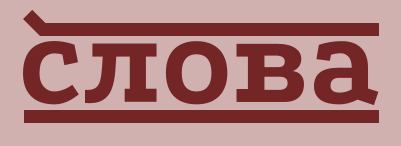

<p align="center">
  
</p>

# Overview

Slova (Russian word for "words", pronounced `/slova/`) is a placeholder
tool generating non-existing words. It includes various generators
such as: `word`, `text` & `rap`.

# Install

```bash
$ npm install slova
$ yarn add slova
```

# Usage

You can generate a random word, text, rap, etc. with just a few lines of code.

For a word creation you have to define a `word` function wrapper with several options,
all of them are optional:

```js
import { word } from "slova"; // esm
const { word } = require("slova"); // or cjs

const nickname = word(
  5, // Generates a word with 5 letters
  10, // Generates 10 words with a length of 5 letters
  3 // Generates 10 words with a length of 5 letters and 3 syllables
);

console.log(nickname());
// Generates a word with given options
// Always returns an array of words
```

For a text creation you have to define function as well, this time it is a `text`:

```js
import { text } from "slova"; // esm
const { text } = require("slova"); // or cjs

const article = text(
  100, // Generates a paragraph with 100 letters (spaces count as well)
  10, // Generates a paragraph with length of 100 letters & 10 words, if not specified, words amount will be randomized
  3 // Generates 3 paragraphs with given options above
);

console.log(article());
// Generates a text with given options
// Always returns an array of paragraphs
```

Unlike previous functions for a mumble rap generation you'd have to pass a required scheme option:

```js
import { mumbleRap } from "slova"; // esm
const { mumbleRap } = require("slova"); // or cjs

const randomshit = mumbleRap(
    'q-c-q-q-c', // Scheme of the mumble rap separated with "-" (quatrains are "q", choruses are "c")
    150 // Generates a quatrain & chorus with 150 letters (spaces count as well)
);

console.log(randomshit());
```

# Documentation

All the available documentation regarding the usage of the package is in jsdoc of each / types.

# Contributing

Pull requests are welcome. For major changes, please open an issue first to discuss what you would like to change.

# License

This project is under [MIT](https://choosealicense.com/licenses/mit/) license. You can freely use it for your own purposes.

<!-- # Todo

- Add JSDoc
- Return OOP approach
- Return single object argument approach -->